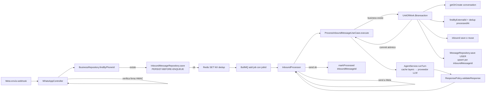

# 04 — Patrones de diseño y métodos aplicados

> Guía de estudio del proyecto **Atiende**. Explica qué se construyó (en especial la Fase 2 de integridad de datos), qué patrones de diseño se usaron, y cómo se aplican en el código real. Léelo en orden: primero la arquitectura, luego los patrones, y al final sigue la traza completa de un mensaje para unir todo.

---

## 1. Resumen: qué se hizo 

La Fase 2 tuvo un objetivo: **que un mensaje de WhatsApp entrante nunca se pierda ni se duplique**, incluso si la DB, Redis o el proceso fallan a mitad de camino.

Antes (Fase 1) el flujo era:

1. Webhook recibe el mensaje y lo encola en BullMQ.
2. Un worker procesa el job: busca la conversación, la crea si no existe, guarda el mensaje del usuario, llama al agente, guarda la respuesta, y la envía a Meta.

Problemas:

- Si el proceso moría entre "guardar el mensaje" y "responder", quedaba **estado a medias** (conversación sin mensaje, mensaje sin respuesta).
- Si BullMQ/Redis caían, el webhook respondía `500` y Meta reintentaba — pero el mensaje original **ya se perdía** si el persist fallaba antes.
- El dedup era solo en memoria/Redis: un reinicio podía duplicar mensajes.

La Fase 2 lo resolvió con tres ideas:

1. **Persistir antes de encolar** (persist-before-enqueue): el webhook guarda el `InboundMessage` en la DB ANTES de mandarlo a la cola.
2. **Esqueleto atómico** (Unit of Work): la creación de conversación + dedup + guardado del mensaje del usuario ocurren dentro de **una sola transacción de base de datos**.
3. **Idempotencia**: el guardado del mensaje del usuario es idempotente por `Message.inboundMessageId` (único), así reintentar un job nunca duplica.

Toda la Fase 2 se verificó con **149 tests unitarios / 20 archivos** (`npm run check`: typecheck + lint + format + vitest), y se desplegó localmente con Docker — la traza en vivo muestra el flujo funcionando, incluido el **cache HIT** en el mensaje repetido.

---

## 2. Arquitectura general: Hexagonal (Ports & Adapters)

### El concepto

Separar el **núcleo de negocio** (reglas, casos de uso) de los **detalles técnicos** (base de datos, Redis, WhatsApp, LLMs). El núcleo depende de *interfaces* (ports), y los adaptadores implementan esas interfaces. El núcleo **nunca** conoce la implementación concreta.

### Regla de oro del repo (AGENTS.md)

> `src/core/` **nunca** debe importar `src/modules/`. Si lo hace, hay un bug de arquitectura.

```
src/core/
  ├── ports/          ← interfaces (contratos)
  ├── use-cases/      ← lógica de negocio (orquestación)
  ├── services/       ← servicios de dominio (AgentService)
  └── tokens.ts       ← tokens de DI para cada port
src/modules/
  └── persistence/postgres/   ← adaptadores (Prisma, Postgres)
  └── channels/whatsapp/      ← adaptador (Meta WhatsApp)
  └── ai/…                     ← adaptadores LLM (Claude, OpenAI, …)
```

### Ejemplo concreto

`UnitOfWorkPort` es el **port** (`src/core/ports/unit-of-work.port.ts`):

```ts
export interface UnitOfWorkPort {
  withTransaction<T>(fn: (ctx: UnitOfWorkContext) => Promise<T>): Promise<T>;
}
```

`PostgresUnitOfWork` es el **adaptador** (`src/modules/persistence/postgres/unit-of-work.ts`):

```ts
@Injectable()
export class PostgresUnitOfWork implements UnitOfWorkPort {
  constructor(private readonly prisma: PrismaService) {}

  async withTransaction<T>(fn: (ctx: UnitOfWorkContext) => Promise<T>): Promise<T> {
    return this.prisma.$transaction(
      async (tx) => fn({
        conversationRepo: new ConversationRepository(tx),
        inboundMessageRepo: new InboundMessageRepository(tx),
        messageRepo: new MessageRepository(tx),
      }),
      { maxWait: 5_000, timeout: 10_000 },
    );
  }
}
```

El caso de uso (`ProcessInboundMessageUseCase`) inyecta el **port** vía token, no la clase:

```ts
@Inject(UNIT_OF_WORK_TOKEN) private readonly unitOfWork: UnitOfWorkPort,
```

**Beneficios:** si mañana cambias Postgres por otra DB, o quieres una implementación "en memoria" para tests, cambias el adaptador en un módulo y el núcleo no se toca.

---

## 3. Patrones de diseño aplicados

Cada patrón con: qué es → dónde está → cómo se aplica → por qué.

### 3.1 Repository

**Qué es.** Encapsula el acceso a datos: oculta la DB y expone operaciones de dominio (`save`, `findRecent`, `getOrCreate`). El resto del código nunca escribe SQL.

**Dónde.** `src/modules/persistence/postgres/message.repository.ts`, `conversation.repository.ts`, `inbound-message.repository.ts`, etc.

**Cómo se aplica.**

```ts
@Injectable()
export class MessageRepository {
  constructor(@Inject(PrismaService) private readonly prisma: PrismaDbClient) {}

  async save(data: { … }): Promise<Message> {
    // …
    return this.prisma.message.upsert({
      where: { inboundMessageId: data.inboundMessageId },
      create: createData,
      update: {},
    });
  }
}
```

Nota interesante: el constructor recibe `PrismaDbClient`, un tipo unión `PrismaService | Prisma.TransactionClient`. Esto permite usar el mismo repositorio con el client global (DI) o con el client de una transacción (Unit of Work).

**Por qué.** Aisla el esquema; centraliza la idempotencia (upsert); y permite construir repositorios "frescos" por transacción.

### 3.2 Unit of Work

**Qué es.** Agrupa varias operaciones en una sola transacción: o **todas commitean** o **ninguna** (rollback). Evita estados a medias.

**Dónde.** Port en `src/core/ports/unit-of-work.port.ts`; implementación en `unit-of-work.ts`.

**Cómo se aplica.** El caso de uso envuelve el "esqueleto" del pipeline en `withTransaction`:

```ts
const result = await this.unitOfWork.withTransaction(async (ctx) => {
  const convo = await ctx.conversationRepo.getOrCreate(business.id, 'WHATSAPP', message.from);
  const existing = await ctx.inboundMessageRepo.findByExternalId(business.id, message.externalMessageId);
  if (existing?.processedAt) return { alreadyProcessed: true, convo, inboundMsgId: existing.id };
  const inboundId = existing?.id ?? (await ctx.inboundMessageRepo.save({…})).id;
  await ctx.messageRepo.save({
    conversationId: convo.id, role: 'USER',
    content: [{ type: 'text', text: message.text }],
    inboundMessageId: inboundId,
  });
  return { alreadyProcessed: false, convo, inboundMsgId: inboundId };
});
```

**Regla de uso** (documentada en el port): el callback **no** debe hacer llamadas largas (LLM, HTTP) porque mantiene la transacción abierta. Aquí solo se persiste el "esqueleto"; la llamada al agente ocurre **después**, fuera de la transacción.

**Detalle fino.** `$transaction` con `{ maxWait: 5_000, timeout: 10_000 }`: Prisma usa 5s por defecto en transacciones interactivas; se subió el timeout para no abortar si una tool tarda. La transacción usa el **interactive pattern** (callback con `tx`), que da acceso al client aislado.

### 3.3 Dependency Injection (DI) / Inversión de Control

**Qué es.** El framework (NestJS) construye los objetos y los inyecta; las clases no crean sus dependencias con `new`.

**Dónde.** Todo el proyecto. NestJS usa `reflect-metadata` + el decorador `@Injectable()`.

**Cómo se aplica.**

- Tokens para ports: `src/core/tokens.ts` (convención `UPPER_SNAKE_CASE_TOKEN`):

```ts
export const UNIT_OF_WORK_TOKEN = 'UNIT_OF_WORK_TOKEN';
```

- Binding token → adaptador en el módulo (`postgres-persistence.module.ts`):

```ts
{ provide: UNIT_OF_WORK_TOKEN, useExisting: PostgresUnitOfWork }
```

- Consumo en el caso de uso:

```ts
@Inject(UNIT_OF_WORK_TOKEN) private readonly unitOfWork: UnitOfWorkPort,
@Optional() @Inject(RESPONSE_POLICY_TOKEN) private readonly responsePolicy?: ResponsePolicyPort,
```

`@Optional()` marca dependencias que pueden no estar (p. ej. la política de respuestas o los caches), habilitadas por feature flags.

**Lección aprendida (bug crítico de la Fase 2).** NestJS resuelve las dependencias leyendo `design:paramtypes`, que TypeScript emite **solo cuando hay decoradores** (`@Injectable()`) y solo si el tipo es una **clase**. Un tipo unión como `PrismaService | Prisma.TransactionClient` NO se puede representar: TS emite `Object`. Resultado: Nest no sabía qué inyectar y la app **no arrancaba** (crash de boot), aunque typecheck y tests pasaran.

```ts
// Emitido como [Object] → Nest no puede resolverlo
constructor(private readonly prisma: PrismaDbClient) {}

// Fix: token explícito que anula la metadata emitida
constructor(@Inject(PrismaService) private readonly prisma: PrismaDbClient) {}
```

La prueba: se compiló `meta-check.ts` con `--emitDecoratorMetadata` y se leyó el JS emitido → `__metadata("design:paramtypes", [Object])`. Para evitar que esto vuelva a pasar en silencio, se agregó `postgres-persistence.module.spec.ts`, un test que compila el módulo real con Nest Testing y resuelve todos los providers (si la metadata de DI está mal, el test falla).

### 3.4 Ports & Adapters (Hexagonal)

Ya cubierto en §2. Los tokens + módulos `@Global()` (`PrismaModule`, `PostgresPersistenceModule`) hacen que los adaptadores estén disponibles sin importarlos en cada módulo consumidor.

### 3.5 Strategy (Estrategia)

**Qué es.** Definir una familia de algoritmos intercambiables en runtime detrás de una interfaz común.

**Dónde.**

- **Proveedores LLM** (`src/modules/ai/`): Claude (primario), OpenAI (fallback + embeddings), Gemini, Groq. `AgentService` elige el proveedor según config; si el primario falla, usa el fallback.
- **Caches** (`EXACT_CACHE_TOKEN`, `SEMANTIC_CACHE_TOKEN`): ambos implementan `ResponseCachePort` con `lookup`/`store`. El caso de uso los recorre en cadena:

```ts
const cacheLayers = [this.exactCache, this.semanticCache].filter(Boolean) as ResponseCachePort[];
```

- **Response Policy** (`RESPONSE_POLICY_TOKEN`): implementa `checkScope`, `validateResponse`, `buildSystemPromptExtras`.

**Por qué.** Se puede habilitar/deshabilitar cada estrategia por feature flag (módulo-registry) sin tocar el núcleo.

### 3.6 Adapter (Adaptador)

**Qué es.** Convierte la interfaz de un sistema externo en la interfaz que el dominio espera.

**Dónde.** `src/modules/channels/whatsapp/whatsapp.adapter.ts` (`send`, `verifyWebhookSignature`, `parseInboundWebhook`), `src/modules/persistence/postgres/prisma.service.ts`, adaptadores de IA.

**Cómo se aplica.** El dominio usa `WhatsAppPort`; el adaptador traduce a la API de Meta Graph (HTTP). El webhook llega como payload de Meta y el adapter lo convierte en el `InboundMessage` del dominio.

### 3.7 Chain of Responsibility (Cadena de responsabilidad)

**Qué es.** Encadenar validadores/filtros; cada eslabón decide si procesa o pasa al siguiente.

**Dónde.** Validación de respuestas: el texto del agente pasa por `ResponseValidator` (señales de alucinación como "no tengo información…, pero") y por `responsePolicy.validateResponse`; si no aprueba, se aplica un texto modificado. También los guards HTTP (RolesGuard) y la verificación de firma HMAC del webhook.

### 3.8 Circuit Breaker + Retry (Cortacircuitos)

**Qué es.** Proteger el sistema ante fallos de un servicio externo: si el proveedor falla N veces seguidas, "abrir" el circuito (no llamarlo por un tiempo) en vez de seguir intentando en loop.

**Dónde.** Adaptadores LLM (Claude, OpenAI, Gemini, Groq) en `src/modules/ai/`.

**Cómo se aplica.** `AgentService` orquesta el fallback entre proveedores y añade timeouts (`AbortController`) para que una llamada colgada no bloquee el worker.

### 3.9 Cache-Aside (caché al lado)

**Qué es.** El código lee del caché; si hay miss, calcula desde la fuente y puebla el caché.

**Dónde.** Caché exacta (Redis, clave = sha256 del texto) y caché semántica (pgvector, similitud coseno).

**Cómo se aplica.** `lookup` en los cache layers; si hay HIT y el mensaje viene con inbound, se devuelve directo y el processor marca `processedAt` después del envío. En el log en vivo se ve: *"exact cache HIT for business=…"* en el segundo mensaje idéntico (respuesta en ~1s en vez de ~6s).

### 3.10 Transactional Outbox (variante simplificada): persist-before-enqueue

**Qué es.** El patrón *outbox* garantiza que un evento (o job) solo se "publica" si el estado ya quedó persistido, evitando mensajes perdidos. La versión clásica escribe el evento en la misma transacción de la DB; un worker lo relee y lo publica.

**Cómo se aplica aquí (versión manual).** En `whatsapp.controller.ts`:

1. Se persiste el `InboundMessage` **primero** (si falla → `503 ServiceUnavailableException`, Meta reintenta el webhook).
2. Recién después se encola el job en BullMQ.

```ts
let inboundId: string | undefined;
const business = await this.businessRepo.findByPhoneId(m.externalAccountId);
if (business) {
  try {
    const saved = await this.inboundRepo.save({…});
    inboundId = saved.id;
  } catch (error) {
    throw new ServiceUnavailableException('Could not persist inbound message');
  }
}
// …más tarde:
await this.inboundQueue.add('process', { inboundMessageId: inboundId ?? m.externalMessageId, … }, { jobId });
```

**Por qué.** Si el enqueue falla (Redis caído), la DB ya tiene el inbound; Meta reintenta y el dedup por constraint único evita duplicados → **zero-loss (NFR-8)**. Es una aproximación manual al outbox: la diferencia es que aquí el "publicador" es el propio webhook y el reintento lo maneja Meta.

### 3.11 Idempotencia (Idempotency Key)

**Qué es.** La misma operación ejecutada N veces produce el mismo resultado, sin duplicar efectos.

**Cómo se aplica (triple capa — defensa en profundidad):**

| Capa | Mecanismo | Rol |
|---|---|---|
| Redis | `SET dedupKey 1 EX 86400 NX` | Dedup rápido (best-effort) |
| DB | Constraint única `(businessId, externalMessageId)` en `InboundMessage` | Dedup fuerte si Redis cae |
| DB | `upsert` de `Message` por `inboundMessageId` único | Idempotencia del USER message |

El `save` de `InboundMessageRepository` captura el error `P2002` (constraint unique) y devuelve la fila existente:

```ts
catch (error: unknown) {
  if (error instanceof Prisma.PrismaClientKnownRequestError && error.code === 'P2002') {
    const existing = await this.prisma.inboundMessage.findFirst({ where: { businessId, externalMessageId } });
    if (existing) return existing;
  }
  throw error;
}
```

Y el `MessageRepository.save` usa `upsert` (SQL `INSERT … ON CONFLICT DO NOTHING`):

```ts
return this.prisma.message.upsert({
  where: { inboundMessageId: data.inboundMessageId },
  create: createData,
  update: {},
});
```

### 3.12 At-Least-Once Delivery

**Qué es.** Entrega garantizada pero con posible duplicado; el consumidor debe ser idempotente para tolerar el duplicado.

**Cómo se aplica.** `processedAt` se marca **solo después** de que el envío a Meta fue exitoso (`inbound.processor.ts`):

```ts
if (result.responded && result.responseText) {
  await this.whatsapp.send({…});
  if (result.inboundMessageId) {
    await this.processInbound.markProcessed(result.inboundMessageId);
  }
}
```

Si el send falla → `throw` → BullMQ reintenta el job → el USER message no se duplica (upsert idempotente) → se re-envía. El dedup del use case solo ignora mensajes ya `processedAt`. Resultado: **mensaje o se pierde, o se procesa y responde**; nunca se procesa dos veces con efecto doble.

### 3.13 Feature Flags / Module Registry

**Qué es.** Encender/apagar módulos por entorno sin desplegar código.

**Dónde.** `src/config/features.ts` (esquema) + `src/config/module-registry.ts` (hidratado desde env vars). Los módulos se cargan condicionalmente al boot.

---

## 4. Métodos y técnicas de base de datos

### 4.1 Interactiv transactions de Prisma

`prisma.$transaction(async (tx) => …)`: abre una transacción, ejecuta el callback con un client aislado, y commitea/rollbackea al final. Opciones usadas: `maxWait` (tiempo máximo esperando por una conexión) y `timeout` (duración máxima de la transacción).

### 4.2 `upsert`

`upsert({ where, create, update })` → `INSERT … ON CONFLICT`. Base de la idempotencia de `MessageRepository.save` y de `ConversationRepository.getOrCreate` (busca la conversación `businessId_channel_customerIdentifier`, si no existe la crea, si existe actualiza `lastMessageAt`).

### 4.3 Constraints y naming en el esquema

`prisma/schema.prisma`:

```prisma
model Message {
  // …
  inboundMessageId String? @unique @map("inbound_message_id") @db.Uuid
  inboundMessage   InboundMessage? @relation(fields: [inboundMessageId], references: [id], onDelete: SetNull)
}

model InboundMessage {
  // …
  messages Message[]
}
```

- `@unique` → índice único (garantiza la idempotencia a nivel DB).
- `@db.Uuid` → tipo UUID nativo de Postgres (16 bytes, más eficiente que string).
- `@map("inbound_message_id")` → convención de naming snake_case en la DB, camelCase en el código.
- `onDelete: SetNull` → si el inbound se borra, el mensaje queda pero sin referencia.

### 4.4 `db push` vs `migrate dev`

- `npx prisma db push`: sincroniza el esquema directo a la DB. **Se usa en este repo** porque `migrate dev` falla por problemas de encoding con la shadow DB.
- Precaución: `db push` reconcilia TODO el esquema; si la DB se desvió del `schema.prisma`, puede proponer cambios destructivos (señalados con `--accept-data-loss`). El cambio de la Fase 2 es aditivo (columna nullable), por lo que fue seguro. **Orden correcto:** aplicar esquema → reiniciar la app (el build regenera el client de Prisma).

### 4.5 Redis SET con flags

`SET key value EX 86400 NX` → setea solo si no existe, con expiración de 24h. Devuelve `1` si se insertó (primera vez) o `null` si ya existía (duplicado). Es la base del dedup rápido del webhook:

```ts
const firstSeen = await this.redis.set(dedupKey, '1', 'EX', 86_400, 'NX');
const isDuplicate = !firstSeen;
```

Como es best-effort, si Redis falla se registra un WARN y se sigue (la DB sigue protegiendo).

---

## 5. Traza end-to-end de un mensaje (unir todo)



Puntos clave de la traza:

1. El `jobId` es `{accountId}-{externalMessageId}` → BullMQ **deduplica jobs** por id.
2. El inbound lleva `inboundMessageId` cuando el negocio existe; si no, el job cae en `externalMessageId` (procesamiento sin persistencia).
3. Mensajes **bloqueados por scope** también devuelven el inbound id → el processor envía la respuesta de rechazo y lo marca processed (at-least-once, sin filas huérfanas).
4. Mensajes ya procesados (`existing.processedAt`) → retorno temprano `{ responded: false }`, sin costo de LLM.
5. El ASSISTANT message y el `updateStatus` de escalamiento se guardan **fuera** de la transacción (tras la respuesta del agente), porque el agente es lento y no debe sostener una transacción abierta.

---

## 6. Métodos transversales de seguridad y observabilidad

| Tema | Técnica | Dónde |
|---|---|---|
| Webhook | Verificación HMAC `x-hub-signature-256` (skipped en dev) | `whatsapp.controller.ts` |
| Autenticación | JWT + refresh token rotation, RolesGuard, Zod, rate limiting, audit (LoginAttempt) | `src/modules/auth/` |
| Errores | Global exception filter: envelope consistente sin leaks de stack | `src/core/filters/` |
| Logs | JSON logging (`LOG_FORMAT=json`), log estructurado por evento (`agent_turn` con modelo/costos/latencia) | `src/core/logger/` |
| Health | `GET /health` (check de DB) usado por el HEALTHCHECK del Dockerfile | `src/modules/health/` |
| Env | Validación Zod en boot (fail-fast) — `src/config/env.ts` es la fuente de verdad | `src/config/env.ts` |
| Deploy | Dockerfile multi-stage (base/dev/builder/production), USER node, healthcheck con `$${PORT:-3000}` | `Dockerfile` |

---

## 7. Verificación de calidad

- `npm run check` = `typecheck → lint:check → format:check → test`. **149 tests / 20 archivos.**
- Tests co-locados como `*.spec.ts` junto al código.
- Tests destacados:
  - `postgres-persistence.module.spec.ts` — compila el módulo real con Nest Testing (detecta errores de DI al boot; es el test que habría evitado el bug crítico).
  - `process-inbound-message.spec.ts` — idempotencia, dedup, mensajes bloqueados, reintentos mid-flight (19 tests).
  - `unit-of-work.spec.ts` — verifica que los repositorios de la transacción usan el client aislado (`tx`).

---

## 8. Glosario

| Término | Significado |
|---|---|
| **Port** | Interfaz del dominio para una capacidad externa. |
| **Adapter** | Implementación concreta de un port. |
| **Token de DI** | Clave (`UNIT_OF_WORK_TOKEN`) para resolver un port en NestJS. |
| **Unit of Work** | Agrupación de escrituras en una transacción atómica. |
| **Idempotencia** | Ejecutar la misma operación N veces = mismo efecto que una vez. |
| **At-least-once** | Garantía de entrega con posibles duplicados (requiere consumidor idempotente). |
| **Zero-loss** | Ningún mensaje se pierde, aunque fallen componentes intermedios (NFR-8). |
| **Best-effort** | Optimización que intenta hacer algo pero tolera que falle. |
| **Outbox** | Patrón para publicar eventos solo cuando el estado ya se persistió. |
| **design:paramtypes** | Metadata que TypeScript emite (con `emitDecoratorMetadata`) con los tipos del constructor; NestJS la usa para DI. |
| **P2002** | Código de error de Prisma para violación de constraint único. |

---

## 9. Archivos clave de referencia

| Archivo | Rol |
|---|---|
| `src/core/ports/unit-of-work.port.ts` | Port + contexto de transacción (contrato). |
| `src/modules/persistence/postgres/unit-of-work.ts` | Adaptador Postgres del Unit of Work. |
| `src/modules/persistence/postgres/prisma.service.ts` | `PrismaService` + tipo `PrismaDbClient`. |
| `src/core/use-cases/process-inbound-message.ts` | Caso de uso principal (orquesta todo). |
| `src/modules/channels/whatsapp/whatsapp.controller.ts` | Webhook: persist-before-enqueue + dedup Redis. |
| `src/modules/queue/inbound.processor.ts` | Worker: send → markProcessed (at-least-once). |
| `src/core/tokens.ts` | Tokens de DI de todos los ports. |
| `src/modules/persistence/postgres/postgres-persistence.module.ts` | Binding token → adaptador. |
| `src/modules/persistence/postgres/postgres-persistence.module.spec.ts` | Test de wiring DI. |
| `prisma/schema.prisma` | Esquema (idempotencia por `inboundMessageId`). |
| `src/config/module-registry.ts` / `features.ts` | Feature flags. |
| `src/config/env.ts` | Validación de variables de entorno. |
| `Dockerfile` / `docker-compose.yml` | Build multi-stage + Postgres/Redis. |
